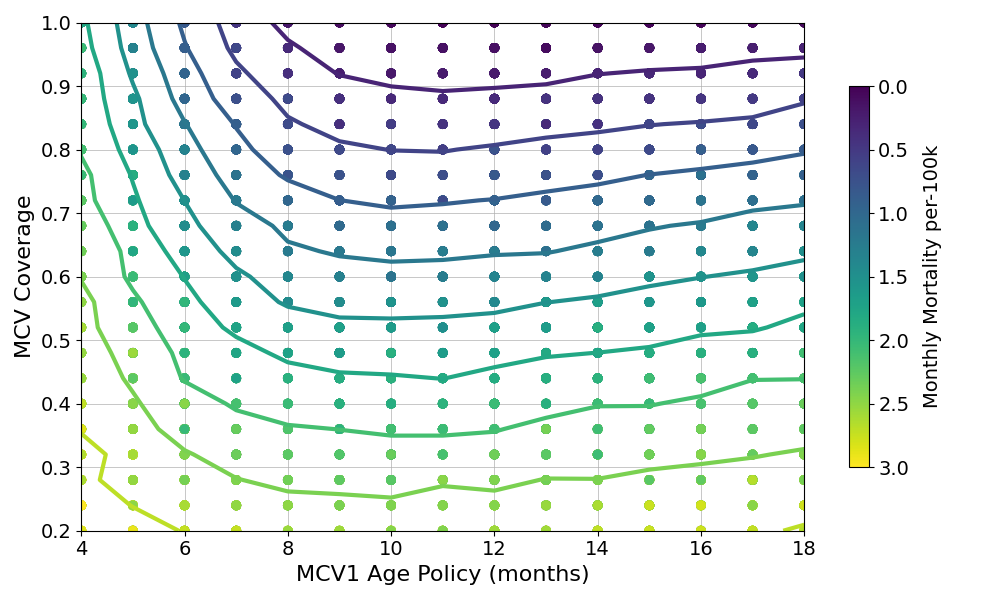
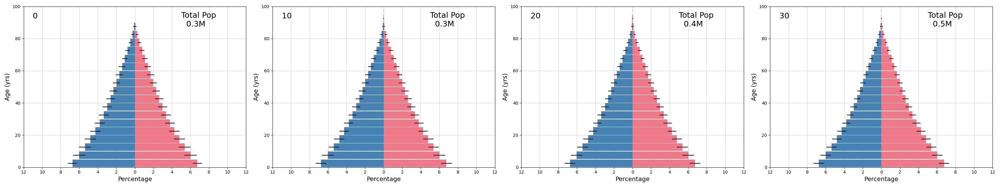

===============
model_measles01
===============

This model explores the burden of measles for various ages of MCV1 administration. Burden is calculated using a case-fatility rate of around 2% for infants, and declining with increased age. Age at MCV1 administration is interpreted as the age policy, with individual variation in actual age of vaccination. Primary vaccine failure occurs in 5% of infants when vaccinated at 9 months, with increasing rates of failure at younger ages.

Populations are well mixed and reproduce the age distribution forecast for the DRC in the year 2040. This distribution is held at equilibrium for the duration of the simulation. Over the 30 year simulation period, the total population grows from 250k to around 485k.

