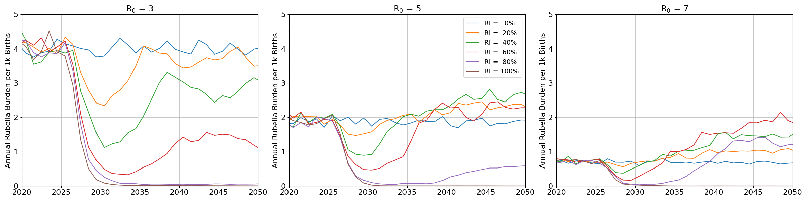
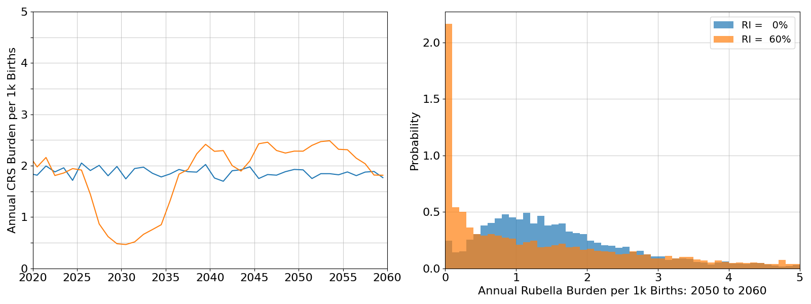
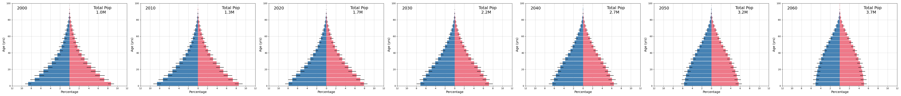
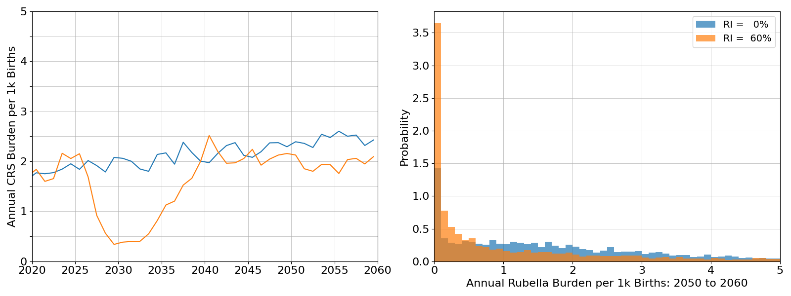

===============
model_rubella01
===============

This model explores the dynamics of rubella infection and burden following introduction of rubella vaccine. Outcomes form this model were used in manuscripts focused on the general case for sub-Saharan Africa (https://doi.org/10.3390/vaccines12070811) and leveraging serodata specific to the Democratic Rebulblic of the Congo (https://doi.org/10.1016/j.jvacx.2021.100127 and https://doi.org/10.1016/j.jvacx.2022.100215).

Example outcomes below cover the period 2000 through 2050, and assume vaccine introduction in 2025 through routine immunization. Output prior to 2020 is ignored as it may be influenced by incorrect initialization assumptions. Baseline results use an average R0 value of 5.0, and illustrate how incomplete vaccination could lead to a resurgence of burden around 15 years after vaccine introduction.

.. image:: figures/ref_rcv_baseline.png

Infectivity (assumed R0 value) has a very stong effect on the pattern of resurgence. Burden outcomes for an assumed R0 of 5.0 (above) are juxtaposed with outcomes for an R0 of 3.0 (left panel) and an R0 of 7.0 (right panel).

At lower levels of infectivity, the rate of uncontrolled burden is elevated and the risk of resurgence is absent. Higher infectivity is associated with much lower levels of burden; even if resurgence does occur, the levels of burden remain below those rates estimated at lower levels of infectivity.

Post-vaccine introduction, year-to-year variation in burden will increase even when the long term average is remain similar to pre-vaccination rates. With vaccination, interruption becomes more common, and suceptibility accumulation may lead to larger outbreaks.

The examples above assume equilibrium demography: constant growth rate and invariant population pyramid shape. This assumption leads to rates of infection and burden that are constant in the long term.

.. image:: figures/ref_rcv_demog_ss.png

Actual demography for sub-Saharan Africa, based on medium projections from the UN WPP, is expected to undergo demographic transition. Both fertility and mortality are expected to decline:

Correctly accounting for demographic transition shows the rate of burden absent vaccination will continute to increase and periods of interruption become more common. The rates of vaccination needed to ensure long term reductions in burden are also lower.

