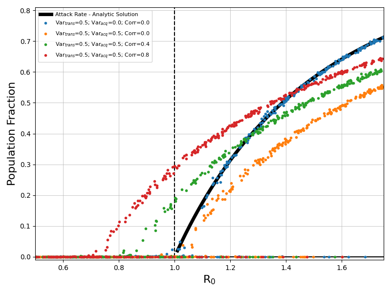

==================
model_covariance01
==================

This example demonstrates the impact of heterogeneity on epidemic attack rate. These simulations sweep over R0 with fixed levels for variance in an individual's acquisition risk, transmission rate, and covariance between acquisition risk and transmission rate.

Each simulation uses a single node of fully susceptible individuals and an outbreak is initialized by a constant importation pressure of infected individuals. There is no age structure, vital dynamics, or waning.

Example distributions for the four sets of heterogeneity examined in these simulations are shown below.

